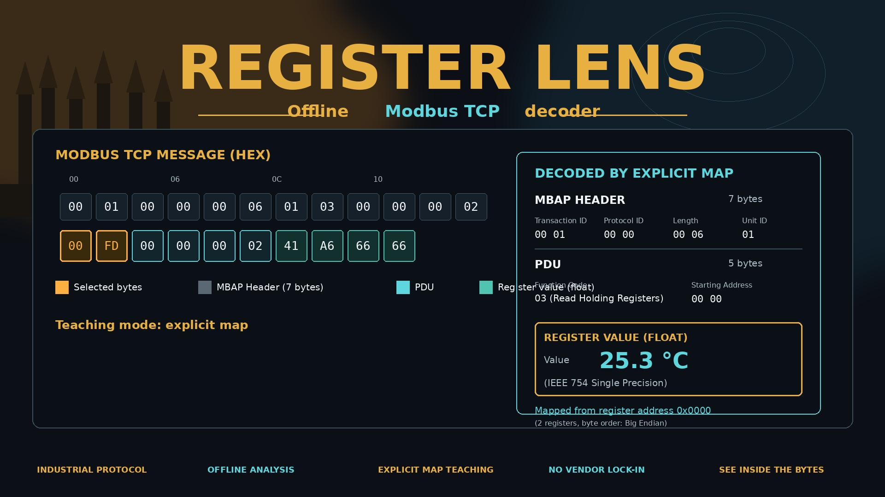

# Register Lens



Local, offline Modbus TCP decoder and teaching tool. Paste a saved request and response, inspect individual bytes, apply an explicit register map, and see how those bytes become values.

Register Lens serves technicians, students, and engineers who are examining authorized, previously saved data. The examples in this repository are synthetic. Wireshark remains the general capture tool; Register Lens explains one selected register transaction. It is not a packet-capture replacement, a vulnerability scanner, a device-discovery tool, or an industrial control system.

The cover image is illustrative poster art. The decoder follows this README and the build sheet: function 03, function 04, and their exceptions, with `uint16` / `int16` explicit scaling. It does not decode IEEE-754 floating-point registers.

Educational offline analysis. Verify device documentation before using interpretations in operational decisions.

## Prerequisites

- Node.js 22.13 or newer (developed on Node.js 24)
- npm 10 or newer

Browser tests need a one-time Chromium install:

```bash
npx playwright install chromium
```

On a fresh Linux machine the matching system libraries are installed with:

```bash
npx playwright install --with-deps chromium
```

## Commands

```bash
npm ci
npm run dev
npm run build
npm run preview
npm test -- --run
npm run test:e2e
```

`npm run dev` serves the Vite development server on `http://127.0.0.1:5173`. `npm run preview` serves the production build on `http://127.0.0.1:4173`. Decoding does not require a network connection after `npm ci` and `npm run build`. Open the app through one of those local servers. This project does not claim that opening `dist/index.html` directly from disk works.

## Architecture

Protocol logic is plain TypeScript and does not read React state.

| Module | Responsibility |
| --- | --- |
| `src/protocol/hex.ts` | Hex normalization and input limits |
| `src/protocol/decodeMessage.ts` | MBAP and PDU decoding for one user-labeled message |
| `src/analysis/analyze.ts` | Exchange pairing and register rows |
| `src/map/validateMap.ts` | Closed schema version 1 validation |
| `src/map/interpret.ts` | Explicit `uint16` / `int16` scaling |
| `src/explain/explain.ts` | Deterministic explanation text |
| `src/report/exportReport.ts` | Markdown and JSON evidence reports |
| `src/ui/` | Accessible panels over those results |

Versions reported in evidence files:

- App `0.1.0`
- Decoder `1.0.0`
- Mapper `1.0.0`
- Report schema `1`

## Supported behavior

- One Modbus TCP application data unit per box. These are MBAP plus PDU bytes, without Ethernet, IP, or TCP headers.
- Direction is the box you use. The decoder does not infer direction from the bytes.
- Function 03 (Read Holding Registers) and function 04 (Read Input Registers).
- Exception responses 83 and 84 with exactly one exception-code byte.
- Known exception names from the Modbus application specification. Unknown codes stay unknown.
- Big-endian 16-bit words.
- Explicit map types `uint16` and `int16`.
- Engineering value `typedRaw × scale + offset` only when type, scale, and offset are all present and the result is finite.
- Signed values use two's complement: `u >= 32768 ? u - 65536 : u`.
- Pairing inside the selected exchange on transaction ID, unit ID, and function. A normal response must also have byte count `2 × quantity`.
- Evidence export as Markdown or JSON, only when you choose Export.

A response alone shows word indexes and unsigned raw words. Address and meaning stay unknown until a valid matching request is present.

## Unsupported behavior

- Write functions and every function other than 03, 04, 83, and 84
- Modbus RTU, Modbus ASCII, and CRC checks
- Packet capture, PCAP import, TCP stream reassembly, sockets, scanning, and live polling
- Multi-word values, floating-point registers, bitfields, and byte swapping
- Automatic vendor-map discovery
- Parsing documentation labels such as `40101` or `30001` into wire addresses

Unsupported functions still show the validated MBAP envelope and the raw PDU. They are not labeled malformed. A protocol exception is a device-reported outcome, not a malformed frame, and this tool does not infer its cause.

## Map schema

```json
{
  "schemaVersion": 1,
  "name": "Synthetic teaching map",
  "mapVersion": "1.0.0",
  "source": "Invented demonstration data; no real equipment",
  "entries": [
    {
      "unitId": 1,
      "functionCode": 3,
      "address": 100,
      "label": "Demo temperature",
      "displayAddress": "40101",
      "type": "uint16",
      "scale": 0.1,
      "offset": 0,
      "unit": "°C"
    }
  ]
}
```

An entry is selected by the exact tuple `(unitId, functionCode, address)`. `label` and `displayAddress` are optional documentation and never change the selector. `type`, `scale`, `offset`, and `unit` are required and may be `null` to say the information is unknown. Accepted types are `uint16`, `int16`, and `null`. Function codes are `3` and `4` only. Unknown fields, duplicate selectors, and unsupported schema versions are rejected with a JSON path. Text fields are limited to 256 characters, labels and display addresses to 80, and units to 32. Imported text is shown as text. It is not HTML, a formula, or an instruction.

The map template download uses the synthetic teaching map above.

## Synthetic examples

Presets are marked **Synthetic**.

### Holding register temperature

Request, 12 bytes:

```text
00 01 00 00 00 06 01 03 00 64 00 01
```

Response, 11 bytes:

```text
00 01 00 00 00 05 01 03 02 00 FD
```

Transaction 1, unit 1, function 03, starting address 100, quantity 1. Request length 6 means the unit ID plus a 5-byte PDU, so the total is `6 + 6 = 12`. Response length 5 means the unit ID plus the response PDU, so the total is `6 + 5 = 11`. Raw `00 FD` is unsigned 253. The synthetic map scales it as `253 × 0.1 + 0 = 25.3 °C`. The label `40101` is documentation, not a wire address. Display rounding is labeled; the internal value is the unrounded evaluation of that formula.

### Input registers and signed values

```text
Request:  00 02 00 00 00 06 01 04 00 00 00 02
Response: 00 02 00 00 00 07 01 04 04 FF 9C 00 C8
```

Two input registers at addresses 0 and 1. `FF 9C` is unsigned 65436, signed −100, then `-10 °C` with scale 0.1. `00 C8` is 200 with unit unknown.

### Exception

```text
00 01 00 00 00 03 01 83 02
```

Nine-byte response paired with the first request. Function 83, exception 02, Illegal Data Address. The device reported that condition.

Other presets cover an unknown map entry, a length field that does not match the bytes, and a mismatched transaction ID. A mismatched exchange does not keep the previous scaled value.

## Limits

Checked before the expensive part of parsing:

| Input | Limit |
| --- | --- |
| Hex text or hex file | 8 KiB |
| Decoded application data unit | 260 bytes |
| Register-map JSON | 256 KiB and 1,000 entries |

Hex may use either letter case and ASCII whitespace. Other characters and an odd number of digits are rejected with a character index. Extra bytes after a length-delimited message are rejected instead of truncated. MBAP length must be 2 through 254, protocol ID must be 0, and the byte count must be exactly `6 + length`. Quantity must be 1 through 125, and `start + quantity - 1` must be at most 65535. Unit ID is an unsigned byte; serial-only address limits are not applied.

## Privacy

- No account, backend, database, hosted model, API key, telemetry, analytics, or update check.
- Imported bytes and maps stay in memory. Reset clears them. Closing the page clears them. They are not written to `localStorage`, IndexedDB, or a service worker.
- Downloads happen only when you choose a template or an evidence export.
- Reports include generation time separately from a capture time you type. Capture time and provenance notes are unverified. A report is not authentication and not a chain of custody.
- The production preview server sends a content security policy that allows only this origin.

## Tests

Unit and component tests use Vitest and React Testing Library. They include at least 20 valid fixtures (ten categories for function 03 and ten for function 04) and at least 10 malformed fixtures, plus pairing, map, export, keyboard, reset, and stale-result checks.

`npm run test:e2e` builds the production bundle, serves it on `127.0.0.1`, and runs Playwright. Those tests block every non-loopback request, exercise both worked examples, signed conversion, invalid-input recovery, file import, downloaded report contents, a 360-pixel viewport, and 200% page zoom.

## Protocol references

Behavior follows the Modbus application protocol specification V1.1b3 and the Modbus messaging on TCP/IP implementation guide V1.0b, limited to the subset listed above.
